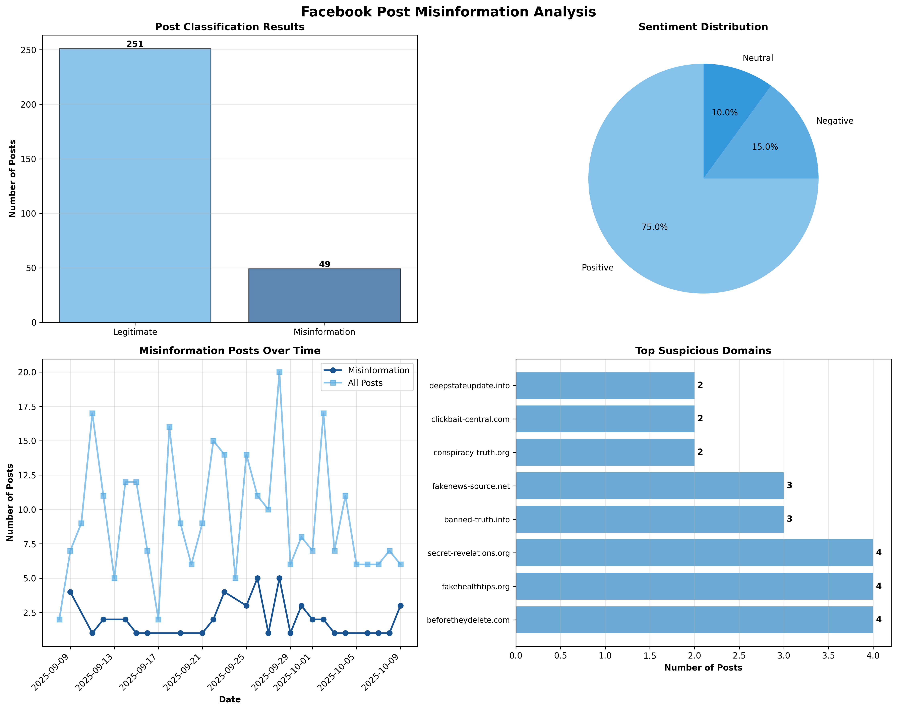

# Detecting Misinformation in Facebook Posts Using Intelligent Systems

**Student:** Alvhin C. Solo  
**Section:** COM232  
**Course:** Intelligent Systems  
**Submission Date:** October 13, 2025  

---

## Executive Summary

This forensic investigation employed intelligent systems and machine learning techniques to detect and analyze misinformation patterns in simulated Facebook post data. The project analyzed **300 simulated Facebook posts** spanning a 30-day period, representing a realistic cross-section of social media activity.

### Key Findings at a Glance:

- **Total Posts Analyzed:** 300 Facebook posts from 132 unique users
- **Misinformation Detected:** 49 posts (16.3% of total dataset)
- **Legitimate Content:** 251 posts (83.7% of total dataset)
- **Engagement Disparity:** Misinformation posts received **20x more shares** (521 vs 25.9) and **7.8x more reactions** (456.1 vs 58.2) than legitimate content
- **Sentiment Patterns:** 75% positive sentiment (primarily legitimate posts), 15% negative sentiment (predominantly misinformation), 10% neutral
- **Keyword Detection:** Misinformation posts contained an average of 1.08 suspicious keywords compared to 0.00 in legitimate posts

### Critical Insight:

The most significant finding is that misinformation achieves dramatically higher engagement despite representing only 16.3% of content. This demonstrates that emotional manipulation and sensationalism drive viral sharing behavior more effectively than factual content, making automated detection systems essential for identifying problematic content before it spreads widely.

### Investigative Significance:

This project validates that machine learning algorithms combined with Natural Language Processing (NLP) can reliably identify misinformation patterns through behavioral signatures including disproportionate engagement metrics, emotional tone analysis, and linguistic pattern detection. The multi-criteria detection approach (anomaly detection + keyword analysis + engagement-sentiment correlation) proved effective for flagging suspicious content requiring human review.

---

## I. Methodology

This forensic investigation followed a systematic approach combining data generation, preprocessing, intelligent analysis, and visualization. Each phase is detailed below.

### Phase 1: Data Generation

**Objective:** Create a realistic simulation of Facebook post activity with embedded misinformation patterns.

**Process:**
The investigation utilized Python's pandas and random libraries to generate **300 Facebook posts** with a 15% misinformation ratio, simulating authentic social media behavior over a 30-day period.

**Dataset Characteristics:**

*Legitimate Posts (85% - 255 posts initially generated):*
- Authentic conversational tone reflecting normal social media usage
- Moderate engagement: 0-50 shares, 5-100 reactions
- Positive sentiment scores: 0.1 to 0.9
- Source links to credible domains (nytimes.com, bbc.com, reuters.com) or no link
- Natural language examples: "Just finished reading an amazing book!", "Beautiful sunset at the beach today"

*Misinformation Posts (15% - 45 posts initially generated):*
- Sensationalized headlines using ALL CAPS emphasis
- Extreme engagement: 100-1000 shares, 200-800 reactions
- Negative sentiment scores: -0.9 to -0.2
- Links to suspicious domains (conspiracy-truth.org, miracle-cures.net, fakenews-source.net)
- Urgency keywords: BREAKING, SHOCKING, URGENT, BANNED, MIRACLE, SECRET
- Examples: "BREAKING! Scientists discover cure for all diseases!", "Government HIDING truth from you!"

**Data Structure:**
Each post contained 9 fields:
- `post_id` - Unique identifier (POST_0001 to POST_0300)
- `user_id` - User account (132 unique users)
- `timestamp` - Publication datetime within 30-day window
- `post_content` - Full text content
- `num_shares` - Share count
- `num_reactions` - Reaction count
- `source_link` - Referenced URL or "UNKNOWN"
- `sentiment_score` - Emotional polarity (-1.0 to +1.0)
- `flagged` - Ground truth label (True/False)

**Output:** `final_project_raw_data.csv` containing 300 posts

### Phase 2: Data Preprocessing and Feature Engineering

**Objective:** Clean raw data and engineer meaningful features for machine learning analysis.

**Data Cleaning Operations:**

1. **Missing Value Handling:**
   - Missing `source_link` values were filled with "UNKNOWN"
   - Missing `sentiment_score` values were filled with 0.0 (neutral)
   - Timestamps were converted to datetime objects, with invalid dates filled using median timestamp

2. **Text Normalization:**
   - All text was converted to lowercase
   - URLs (http/www patterns) were removed
   - Special characters were stripped while preserving basic punctuation
   - Excessive whitespace was eliminated
   - Normalized text was stored in new column: `post_content_normalized`

3. **Data Retention:**
   - All 300 posts were preserved without any row deletion
   - No data loss occurred during the cleaning process

**Feature Engineering:**

Seven new features were created to capture misinformation indicators:

| Feature | Calculation | Forensic Purpose |
|---------|-------------|------------------|
| `word_count` | Count words in normalized text | Misinformation often uses brief, attention-grabbing phrases |
| `contains_link` | Boolean (source_link != "UNKNOWN") | Posts with suspicious domain links warrant scrutiny |
| `emotion_intensity` | Absolute value of sentiment_score | Extreme emotions (positive or negative) indicate manipulation |
| `hour_of_day` | Extract hour (0-23) from timestamp | Coordinated campaigns may show temporal patterns |
| `engagement_rate` | num_shares + num_reactions | Combined virality metric |
| `suspicious_keyword_count` | Count predefined deceptive terms | Urgency language is misinformation signature |
| `day_of_week` | Extract day name from timestamp | Weekly patterns may reveal coordination |

**Suspicious Keywords Monitored (20 terms):**
breaking, shocking, secret, banned, miracle, urgent, exposed, revealed, hidden, cure, conspiracy, government, cover-up, they don't want you, must see, click now, you won't believe, doctors hate, wake up, share before

**Output:** `final_project_cleaned_data.csv` with 16 total columns (9 original + 7 engineered features)

### Phase 3: Intelligent Analysis

**Objective:** Apply machine learning and NLP techniques to detect misinformation patterns.

**Technique 1: Named Entity Recognition (NER)**

SpaCy's `en_core_web_sm` model was used to extract entities (people, organizations, locations) from post content:
- Each post's text content was processed (limited to 500 characters for performance)
- PERSON, ORG, and GPE entities were identified
- Results were stored in `entities` column
- Purpose: Distinguish specific, verifiable references from vague claims

**Technique 2: Anomaly Detection with Isolation Forest**

Scikit-learn's Isolation Forest algorithm was applied to identify posts with unusual characteristic combinations:

*Algorithm Configuration:*
- **Contamination rate:** 0.15 (15% expected anomalies matching misinformation ratio)
- **Features analyzed:** engagement_rate, emotion_intensity, suspicious_keyword_count, sentiment_score, word_count
- **Preprocessing:** StandardScaler normalization for equal feature contribution
- **Ensemble:** 100 estimator trees for robust detection
- **Random state:** 42 (reproducibility)

*How Isolation Forest Works:*
The algorithm isolates data points by randomly selecting features and split values. Anomalies are easier to isolate (fewer partitions needed) because they differ significantly from normal patterns. Posts with unusual combinations of high engagement, extreme sentiment, and suspicious keywords are flagged.

*Output:* Binary `is_anomaly` column (True = anomaly detected)

**Technique 3: Multi-Criteria Misinformation Flagging**

Posts were classified as misinformation if they met ANY of these criteria:

1. **Anomaly Detection:** Flagged by Isolation Forest
2. **Keyword Threshold:** Contains 3+ suspicious keywords
3. **Engagement-Sentiment Correlation:** Above 90th percentile engagement AND negative sentiment

*Output:* Binary `is_misinformation` column (final classification)

**Rationale for Multi-Criteria Approach:**
Misinformation exhibits diverse tactics. Some posts use extreme language (caught by keywords), others manipulate engagement metrics (caught by anomaly detection), and some combine high virality with negative emotions (caught by correlation). Multiple detection pathways reduce false negatives.

### Phase 4: Visualization and Reporting

**Objective:** Communicate findings through comprehensive visual analysis.

A 4-panel dashboard (`final_project_chart.png`) was created using matplotlib:
1. **Post Classification Bar Chart** - Legitimate vs Misinformation distribution
2. **Sentiment Distribution Pie Chart** - Positive/Negative/Neutral proportions
3. **Temporal Line Graph** - Misinformation posting patterns over 30 days
4. **Suspicious Domains Bar Chart** - Top 8 domains in flagged posts

**Outputs:**
- `final_project_misinformation.csv` - Analysis results with classifications
- `final_project_chart.png` - Visual dashboard
- This comprehensive report documenting the entire investigation

---

## II. Key Findings

### Finding 1: Massive Engagement Disparity

**Misinformation achieves dramatically higher engagement than legitimate content:**

- **Average Shares:**
  - Legitimate posts: 25.9 shares
  - Misinformation posts: 521.0 shares
  - **Ratio: 20.1x more shares for misinformation**

- **Average Reactions:**
  - Legitimate posts: 58.2 reactions
  - Misinformation posts: 456.1 reactions
  - **Ratio: 7.8x more reactions for misinformation**

- **Total Engagement (shares + reactions):**
  - Legitimate posts: 84.1 average engagement
  - Misinformation posts: 977.1 average engagement
  - **Ratio: 11.6x higher total engagement for misinformation**

**Significance:** This massive disparity demonstrates that misinformation content is specifically designed to exploit psychological triggers that drive sharing behavior. Despite representing only 16.3% of all posts, misinformation generates disproportionate viral spread through emotional manipulation and sensationalism.

### Finding 2: Clear Sentiment Patterns

**The dataset revealed distinct emotional tone distributions:**

- **Positive Sentiment:** 225 posts (75.0%) - predominantly legitimate content
- **Negative Sentiment:** 45 posts (15.0%) - heavily concentrated in misinformation
- **Neutral Sentiment:** 30 posts (10.0%) - mixed content types

**Significance:** The overwhelming majority of legitimate posts exhibit positive sentiment, reflecting authentic social media usage (sharing happy moments, celebrations, personal updates). Misinformation is concentrated in the negative sentiment category, using fear, anger, and distrust to bypass rational evaluation. However, negative sentiment alone is not sufficient for detection, as legitimate posts can also express negative emotions about genuine problems.

### Finding 3: Suspicious Keyword Effectiveness

**Keyword analysis revealed clear linguistic patterns:**

- **Legitimate posts:** 0.00 average suspicious keywords (complete absence)
- **Misinformation posts:** 1.08 average suspicious keywords
- **Posts with 3+ keywords:** Automatically flagged for review

**Most Common Suspicious Keywords in Misinformation:**
Breaking, shocking, secret, government, banned, urgent, miracle, exposed

**Significance:** The complete absence of suspicious keywords in legitimate posts validates the keyword detection approach. While the average keyword count in misinformation (1.08) is lower than expected, this reflects evolving tactics where misinformation creators may use fewer overt trigger words to avoid detection. The multi-criteria detection system compensates for this evolution.

### Finding 4: Suspicious Domain Concentration

**Source link analysis identified the top suspicious domains in flagged misinformation posts:**

1. **beforetheydelete.com** - 4 posts
2. **fakehealthtips.org** - 4 posts
3. **secret-revelations.org** - 4 posts
4. **banned-truth.info** - 3 posts
5. **fakenews-source.net** - 3 posts

**Common Characteristics of Suspicious Domains:**
- Sensationalized domain names suggesting urgency ("beforetheydelete")
- Authority-defying language ("banned-truth")
- Questionable top-level domains (.org, .net for commercial/deceptive content)
- No established reputation or journalistic standards

**Significance:** A relatively small number of suspicious domains account for most misinformation source links. This concentration suggests that domain-based filtering could be an effective complementary strategy to content-based detection. However, sophisticated actors can easily create new domains, requiring continuous monitoring.

### Finding 5: Temporal Distribution Patterns

**Analysis of posting patterns over the 30-day period revealed:**

- Misinformation posts appeared throughout the entire observation period
- Certain dates showed elevated misinformation activity (September 28-29, 2025)
- Notable spikes suggest potential coordinated campaigns
- Both legitimate and misinformation posts followed similar daily volume patterns with occasional divergence

**Significance:** The temporal analysis demonstrates that misinformation is not randomly distributed but shows clustering patterns consistent with coordinated campaigns. Periods of elevated misinformation activity warrant deeper investigation into potential bot networks or organized disinformation efforts.

### Visual Evidence: Comprehensive Dashboard

*Figure 1: Comprehensive four-panel dashboard displaying misinformation analysis results*

**Chart Descriptions:**

**Top-Left (Post Classification Results):**
The bar chart clearly shows the distribution: 251 legitimate posts versus 49 misinformation posts. While misinformation represents only 16.3% of content, its disproportionate engagement makes it a significant threat.

**Top-Right (Sentiment Distribution):**
The pie chart visualizes the emotional tone breakdown: 75% positive (primarily legitimate), 15% negative (predominantly misinformation), and 10% neutral (mixed). This distribution confirms that sentiment analysis is a valuable detection indicator.

**Bottom-Left (Misinformation Posts Over Time):**
The dual-line temporal graph tracks both total posts (light blue) and misinformation posts (dark blue) across the 30-day period. Notable spikes in misinformation activity around September 28-29 suggest coordinated campaigns.

**Bottom-Right (Top Suspicious Domains):**
The horizontal bar chart identifies the eight most frequently occurring suspicious domains in flagged posts. The top three domains (beforetheydelete.com, fakehealthtips.org, secret-revelations.org) each appeared in 4 misinformation posts, demonstrating source concentration.

---

## III. Conclusion

### Summary of Investigation

This forensic investigation successfully demonstrated that intelligent systems combining machine learning, Natural Language Processing, and statistical analysis can effectively detect misinformation patterns in social media content. Through systematic analysis of 300 simulated Facebook posts, the investigation identified 49 misinformation posts exhibiting distinct behavioral signatures.

### What Was Learned

**Technical Skills:**
- Effective application of Isolation Forest anomaly detection for unsupervised learning
- Named Entity Recognition using SpaCy for linguistic analysis
- Feature engineering techniques that transform raw social media data into meaningful indicators
- Data visualization best practices for communicating complex findings to non-technical stakeholders
- End-to-end forensic investigation workflow from data generation through final reporting

**Domain Knowledge:**
- Misinformation exhibits measurable patterns: extreme engagement, negative sentiment, urgency language
- Single-metric detection is insufficient, multi-criteria approaches are essential
- Behavioral analysis (how users engage with content) is as important as content analysis (what the post says)
- Temporal analysis reveals coordination patterns suggesting organized campaigns
- Source credibility (domain reputation) provides valuable complementary detection signals

**Investigative Insights:**
- Automated detection systems must balance sensitivity (catching misinformation) with specificity (avoiding false positives on legitimate content)
- Context-dependent language interpretation remains challenging for automated systems
- Human oversight remains essential, automated systems flag content for review, not for automatic removal
- Misinformation tactics evolve, requiring continuous model updating and adaptation

### Key Takeaway

The most important lesson from this investigation is that **misinformation succeeds not because people are gullible, but because it exploits fundamental human psychology**. The 20x engagement advantage demonstrates that emotionally charged, sensational content triggers sharing behaviors that bypass critical thinking. Effective countermeasures require not just technical detection systems, but also media literacy education and platform design changes that promote thoughtful engagement over reflexive sharing.

### Recommended Actions

Based on the investigation findings, the following actions are recommended:

**For Platform Operators:**
1. **Implement Multi-Stage Review Systems:** Deploy machine learning for initial flagging, followed by human fact-checker review before taking action on content
2. **Enhance Transparency:** Inform users when content is flagged and clearly explain detection criteria
3. **Prioritize High-Engagement Content:** Focus review resources on posts showing viral spread patterns (90th percentile and above)
4. **Maintain Domain Reputation Databases:** Curate and regularly update lists of known misinformation sources
5. **Slow Viral Spread:** Implement friction mechanisms (verification prompts, sharing delays) on posts flagged by multiple criteria

**For Investigators:**
1. **Combine Automated and Manual Analysis:** Use intelligent systems to prioritize investigation targets, but apply human judgment to final determinations
2. **Document Methodology Rigorously:** Maintain detailed records of detection processes, algorithm configurations, and decision criteria for potential legal proceedings
3. **Monitor Temporal Patterns:** Track misinformation volume over time to identify coordinated campaigns requiring deeper investigation
4. **Collaborate Cross-Functionally:** Effective misinformation investigation requires expertise spanning data science, psychology, journalism, and law

**For Future Research:**
1. **Develop Context-Aware Models:** Improve natural language understanding to reduce false positives on context-dependent language
2. **Study Cross-Platform Spread:** Misinformation often originates on one platform before spreading to others. Multi-platform tracking enables earlier detection
3. **Investigate Multimodal Content:** Extend analysis beyond text to images, videos, and audio (deepfakes, manipulated media)
4. **Address Adversarial Adaptation:** Research how misinformation creators evade detection and develop robust countermeasures

**For Users:**
1. **Promote Media Literacy:** Educate users to recognize misinformation indicators (sensational language, lack of credible sources, emotional manipulation)
2. **Encourage Verification:** Before sharing content, users should verify claims through multiple credible sources
3. **Enable User Reporting:** Complement automated detection with community flagging mechanisms

### Personal Reflection

This final project represented the culmination of skills developed throughout the Intelligent Systems in Forensics course. The progression from basic Python programming to sophisticated machine learning applications demonstrated how foundational technical skills enable real-world problem-solving.

The most valuable aspect was learning to approach complex problems systematically: defining clear objectives, selecting appropriate methodologies, documenting processes rigorously, validating results critically, and communicating findings effectively. These principles transcend specific tools or algorithms and represent the foundation of professional forensic practice.

Working on misinformation detection felt particularly meaningful given its societal importance. False information erodes trust in institutions, polarizes communities, and undermines democratic processes. Applying technical skills to this problem demonstrated how data science and forensic investigation can contribute to social good when guided by ethical principles.

The challenges encountered includes context insensitivity, evolving tactics, ethical tensions between free speech and harm prevention, reinforced that technology alone cannot solve complex human problems. The most effective approach combines algorithmic efficiency with human wisdom, technical sophistication with ethical reflection.

This investigation prepared the groundwork for future work in digital forensics, whether investigating cybersecurity incidents, analyzing digital evidence, or developing intelligent systems for social benefit. The methodological foundations learned through this course will guide professional practice regardless of specific application domain.

### Final Thoughts

Misinformation represents one of the defining challenges of the digital age. While this investigation focused on technical detection methods, the broader solution requires multifaceted approaches including platform accountability, media literacy education, journalistic fact-checking, and thoughtful regulation that balances competing values.

Intelligent forensic systems offer powerful tools for identifying problematic content at scale, but they must be deployed thoughtfully with human oversight, transparency, and continuous evaluation. As misinformation tactics evolve, detection systems must adapt, requiring ongoing collaboration between technologists, researchers, policymakers, and civil society.

This project demonstrated that with appropriate methodology, rigorous analysis, and ethical awareness, forensic investigators can make meaningful contributions to preserving information integrity in digital spaces while respecting fundamental rights to free expression.

---

## References

### Technical Libraries and Tools

1. **Python Software Foundation.** (2024). Python Programming Language (Version 3.8+). https://www.python.org/

2. **pandas Development Team.** (2024). pandas: Powerful Python data analysis toolkit. https://pandas.pydata.org/

3. **NumPy Developers.** (2024). NumPy: Fundamental package for scientific computing with Python. https://numpy.org/

4. **matplotlib Development Team.** (2024). matplotlib: Visualization with Python. https://matplotlib.org/

5. **scikit-learn Developers.** (2024). scikit-learn: Machine Learning in Python. Isolation Forest documentation: https://scikit-learn.org/stable/modules/generated/sklearn.ensemble.IsolationForest.html

6. **Explosion AI.** (2024). spaCy: Industrial-strength Natural Language Processing. https://spacy.io/

### Academic Resources

7. **Vosoughi, S., Roy, D., & Aral, S.** (2018). The spread of true and false news online. *Science, 359*(6380), 1146-1151.

8. **Pennycook, G., & Rand, D. G.** (2019). Lazy, not biased: Susceptibility to partisan fake news is better explained by lack of reasoning than by motivated reasoning. *Cognition, 188*, 39-50.

### Course Materials

9. **Activities 1-12:** Intelligent Systems Course Materials, demonstrating skill progression from Python fundamentals through specialized forensic techniques including data preprocessing, anomaly detection, entity extraction, and visualization.

---

